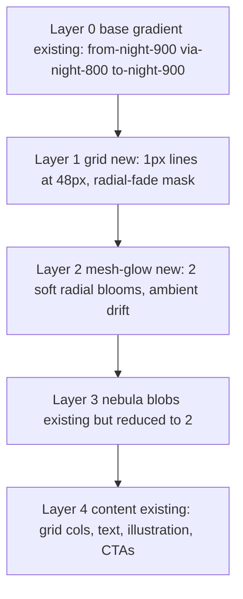

# HealthOS Public Marketing Master Plan

Scope: the public/marketing layer only — [home](frontend/src/app/%5Blocale%5D/%28main%29/page.tsx), [about](frontend/src/app/%5Blocale%5D/%28main%29/about/page.tsx), [services](frontend/src/app/%5Blocale%5D/%28main%29/services/page.tsx), [plans](frontend/src/app/%5Blocale%5D/%28main%29/plans/page.tsx), [articles](frontend/src/app/%5Blocale%5D/%28main%29/articles/page.tsx), their shared primitives in [frontend/src/components/shared/](frontend/src/components/shared/), and the tokens in [frontend/src/app/globals.css](frontend/src/app/globals.css). Stack is preserved: Next.js App Router + Tailwind v4 CSS-first + shadcn/ui + framer-motion (already installed). No new dependencies.

This plan explicitly supersedes [.cursor/plans/marketing_ui_master_plan_e22e3f13.plan.md](.cursor/plans/marketing_ui_master_plan_e22e3f13.plan.md) — it keeps that work's direction and upgrades it into a principal-grade system with sharper IA, stricter quality gates, and a cleaner dependency map.

---

## A. Executive summary

The product already has an uncommonly good foundation for a student health-tech build: a coherent Night Sky palette, a believable hero pattern, decent illustration system, real i18n, and shadcn/ui primitives. What is missing is not visual talent — it is **system pressure**. Each page invents its own rhythm; trust signals are thin; the homepage hero decoration reads slightly "screensaver" next to relatively flat inner pages; and the plans and articles pages lack the proof, comparison, and navigation scaffolding that healthcare audiences expect before they commit.

The direction in one line: **same identity, same structure, more authority — delivered through shared primitives, a strict layering system, and conversion-aware IA on the non-home pages.**

Homepage = atmospheric retouch only (grid + constrained glow, two blobs removed, zero structural change). Other four pages = IA tightening, proof/compare modules, unified card/surface language, and a shared `<Section>` + `<SectionHeader>` skeleton. No rewrite. No new brand. No new stack.

---

## B. Current-state audit

Anchors read for this audit: [home page](frontend/src/app/%5Blocale%5D/%28main%29/page.tsx), [about page](frontend/src/app/%5Blocale%5D/%28main%29/about/page.tsx), [services page](frontend/src/app/%5Blocale%5D/%28main%29/services/page.tsx), [plans page](frontend/src/app/%5Blocale%5D/%28main%29/plans/page.tsx), [articles page](frontend/src/app/%5Blocale%5D/%28main%29/articles/page.tsx), [globals.css](frontend/src/app/globals.css), [SectionHeader.tsx](frontend/src/components/shared/SectionHeader.tsx), [Decorations.tsx](frontend/src/components/shared/Decorations.tsx), [PlanCard.tsx](frontend/src/components/shared/PlanCard.tsx), [ArticleCard.tsx](frontend/src/components/shared/ArticleCard.tsx), [ServiceCard.tsx](frontend/src/components/shared/ServiceCard.tsx).

### What is already working (do not touch)
- Night Sky tokens in `@theme inline` block of [globals.css](frontend/src/app/globals.css): `--color-night-900..50`, `--color-warm-gold/peach/rose`. Strong enough to drive everything below.
- `prefers-reduced-motion` is globally honored in [globals.css](frontend/src/app/globals.css) — do not regress this.
- i18n is real, end-to-end, and per-locale `pickLocale(...)` is used consistently.
- Hero formula (dark gradient + blurred color blobs + gradient headline) reads as a real brand, not template.
- Card family exists: `ServiceCard`, `PlanCard`, `ArticleCard`, `TestimonialCard`, `TeamMemberCard`.

### Visual hierarchy
- Homepage hero at [page.tsx line 39](frontend/src/app/%5Blocale%5D/%28main%29/page.tsx) uses 4 blurred blobs with no structural backdrop. Reads "nebula screensaver". Needs a subtle grid to anchor it and fewer blobs.
- All pages re-invent the `<Badge> + <h2> + 
` cluster instead of using [SectionHeader.tsx](frontend/src/components/shared/SectionHeader.tsx) which already exists and is unused.
- Stats band on home is visually low-contrast compared with adjacent dark hero — sits as a gap, not a beat.
- [Decorations.tsx](frontend/src/components/shared/Decorations.tsx) skewed ribbons compete with tab UI on Services and with filter bar on Plans on narrow viewports.

### Narrative clarity
- About page has three visually similar beats (Story → Vision → Mission) that blur together. Vision + Mission say the same thing twice.
- Services page is pure tab grid after the hero — no "what you get / who it's for" summary and no path to Plans.
- Plans page has no narrative scaffolding: no "how it works", no comparison, no FAQ, no social proof — just hero + filter + grid. This is the highest-stakes page and has the thinnest trust layer.
- Articles page has no search, no counts, no related rail, static "Load more".

### Conversion architecture
- Home hero CTAs point to `/plans` and `/services` — good.
- No secondary conversion surfaces on Services or Articles (no path to Plans).
- No social proof anywhere except a homepage testimonials strip and none on the Plans page where it is needed most.
- Contact form repeats on three pages with different wrappers — one of them is mixed VN/EN copy on Services.

### Trust / proof system
- No "at a glance" credibility strip (founded, team, scope, languages).
- No compliance/disclaimer beyond a single About footer strip — for a health platform this is thin.
- No visible "reviewed by / partnered with" module.
- Team section on About is a flat grid, no role grouping (Core / Advisors), weakening authority.

### Consistency of sections and cards
- Section padding drifts (`py-14`, `py-16`, `py-20`, `py-28`) with no rhythm rule.
- Every card has a slightly different border/shadow/hover/ring treatment. `PlanCard` uses gradient surfaces, `ServiceCard` uses bottom hover bar, `ArticleCard` has no hover polish on the list variant.
- Badge family has at least 4 visual variants with different gradients in the same page — eyebrow usage is not a pattern yet.

### Content density
- Homepage runs ~8 sections of similar card density; the eye never rests.
- Articles list is vertical list only, no grid option, no result count.
- Plans filter bar shows pills + search but no result count or cleared-state guidance.

### Accessibility and readability
- Dark sections lean heavily on `text-white/70` and `text-night-100/70` — trips AA on small text.
- `LeftDecoration`/`RightDecoration` are `-z-10` and `aria-hidden` — correct, but they visually clash on mobile.
- Illustrations carry `alt=""` — intentional decorative, good.
- Focus states on custom category pills rely only on color change — need a visible ring.

### Performance / perceived-performance
- Hero floating illustration is `priority` — correct.
- Inner page heroes all carry `priority` illustrations too — acceptable but can be downgraded for the ones below the fold on mobile.
- Adding atmosphere layers is pure CSS, no JS cost.
- Do not add `framer-motion` reveal to the hero (it delays LCP). Limit reveal to later sections.

---

## C. Product / brand / system gaps and root causes

1. **No shared section shell.** Every page reinvents width + padding + eyebrow pattern → drift. Root cause: [SectionHeader.tsx](frontend/src/components/shared/SectionHeader.tsx) was built but never adopted; no `<Section>` wrapper exists.
2. **No atmosphere primitives.** The "premium dark hero" visual has been hand-rolled three times. Root cause: no `<AtmosphereGrid>` / `<AtmosphereGlow>` exists.
3. **No proof system.** Stats, quotes, compliance lines, partner logos live in ad-hoc places (or not at all). Root cause: no "TrustStrip" module and no plans-scoped proof convention.
4. **No compare primitive.** Plans cannot answer "which is right for me" without a table. Root cause: `<CompareTable>` does not exist and data shape does not encode a matrix.
5. **Eyebrow overload.** Every section has a gradient Badge with slightly different colors. Root cause: no single "eyebrow" recipe — every page picks ad-hoc.
6. **Card anarchy.** Cards diverge in radius, border, hover, and gradient budget. Root cause: no written card contract; every card author improvised.
7. **Decorations vs content collision.** Skewed ribbons on Services/Plans fight the interactive UI. Root cause: decorations were built for storytelling sections and used everywhere.
8. **Homepage "nebula screensaver".** Four blurred blobs without any structural layer beneath. Root cause: a grid/mesh was never part of the original composition.
9. **Plans is under-modulated.** Highest-conversion page is the thinnest information architecture. Root cause: shipped as an MVP grid and never revisited.
10. **Articles is a blog, not a library.** No search, no counts, no related content. Root cause: IA never formalized beyond "show a list".

---

## D. Shared public-page visual system

Principle: **one accent temperature per section, one eyebrow recipe, one card contract, one spacing rhythm.**

### D.1 Color roles (map to existing tokens; no new palette)
- Page base: `--background` / `--foreground` (light default; dark mode via `.dark`).
- Atmosphere surfaces (hero, CTA bands, contact): `night-900 → night-700` gradient.
- Brand accent (gradients, focus ring, highlight span): `night-400` / `night-300`.
- Scarcity / featured accent (badges, recommended plan, featured article): `warm-peach` / `warm-rose` / `warm-gold` — **never body text, never nav, never buttons**.
- Interactive primary: `--primary` (`#1965B3` / `#5BA8C8` in dark) — links, primary buttons, focus ring.
- Muted text: `muted-foreground` only — do not invent new grays.

Rule: **at most one warm accent and one night accent per section**. If a section needs both, the warm accent owns the eyebrow/badge and the night accent owns the CTA — never both on the same element.

### D.2 Typography hierarchy
Font stack already loaded (Be Vietnam Pro). Commit to:
- Display / hero `h1`: `text-5xl md:text-6xl font-extrabold tracking-tight leading-[1.05]`.
- Section `h2`: `text-3xl md:text-4xl font-bold tracking-tight`.
- Subsection `h3`: `text-xl md:text-2xl font-semibold`.
- Eyebrow / section badge: `text-xs tracking-[0.14em] uppercase font-semibold` — one recipe, lives in `<SectionHeader>`.
- Lead paragraph: `text-lg leading-relaxed text-muted-foreground max-w-[65ch]`.
- Body: `text-base leading-relaxed`.
- Gradient text (`bg-clip-text`): **at most one span per section**, and only on `h1`/`h2`.

### D.3 Card / surface language (single contract)
- Default card: `rounded-2xl border border-border/60 bg-card shadow-sm`.
- Hover: `hover:shadow-md hover:border-night-400/30` — color/elevation only, no scale >= 2px.
- Elevated / featured: adds `ring-1 ring-primary/10` and may keep one gradient surface (Plans "Recommended" only).
- Glass surface (dark heroes only): `bg-white/5 border-white/10 backdrop-blur-md`.
- Forbidden: per-card custom gradients, per-card custom radius, `hover:scale-105` on cards larger than a button.

### D.4 Spacing rhythm
- Section vertical: `py-16 md:py-24` for content; `py-20 md:py-28` for hero/CTA.
- Container: `mx-auto max-w-7xl px-4 sm:px-6 lg:px-8` — always via `<Section>`.
- Grid gap: `gap-6 lg:gap-8`.
- Vertical spacing between eyebrow → h2 → p → content inside `<SectionHeader>`: `mb-3 / mb-4 / mb-10`.

### D.5 Border / radius / shadow
- Radii scale already in [globals.css](frontend/src/app/globals.css) via `--radius-*`. Commit:
  - Cards = `rounded-2xl` (= `--radius-2xl`).
  - Inputs / small surfaces = `rounded-lg`.
  - Pills / buttons = `rounded-full`.
- Borders: `border-border/60` on light; `border-white/10` on dark. Nothing else.
- Shadows: `shadow-sm` default, `shadow-md` on hover, colored shadows reserved for hero CTA and featured Plan tier only. No colored shadows on cards that scroll in lists.

### D.6 Motion principles
- Entrance: `opacity 0→1, y 8→0`, 300ms ease-out, fire once per element on viewport enter — only on sections below the fold, never on hero.
- Hover: color/opacity/border only. No scale > 2px. No parallax. No skew.
- Ambient: one system, one place — the homepage hero glow layer. `translate ±8px` over 30s ease-in-out infinite. Gated behind `sm:` breakpoint AND respected by `prefers-reduced-motion`.
- Framer-motion: only for optional `<Reveal>` wrappers in P2. CSS keyframes handle hero ambient to avoid hydration cost on LCP.

### D.7 CTA hierarchy (strict — two levels only)
- **Primary CTA**: `Button` filled with `bg-gradient-to-r from-night-700 via-night-600 to-night-400 text-white rounded-full shadow-md`. At most one per section. Hero and CTA bands only.
- **Secondary CTA**: `Button variant="outline"` with `border-night-600/50 text-night-700 dark:text-night-300`. For "Learn more", "Explore", "See all".
- **Tertiary (link)**: inline gradient-clipped text + `<ChevronRight />`. Used inside cards only.

### D.8 Badge / tag usage rules
- **Eyebrow badge** (only kind above a section title): one recipe — `text-xs tracking-[0.14em] uppercase font-semibold` with a gradient appropriate to the section's temperature.
- **Status/Scarcity badge** (inside a card): `warm-peach` gradient, only on featured/recommended/new items. One per card maximum.
- **Category tag** (on `ArticleCard`, `PlanCard`): solid `night` gradient, compact `text-[10px]`.
- Forbidden: two badges stacked, inline badges mid-paragraph, emoji in badges.

### D.9 Proof / trust module rules
- Three proof surfaces are system-legal:
  1. **At-a-glance strip** — 3-4 compact stats with `muted-foreground` label + `font-extrabold` value. Used under hero on About and Plans only.
  2. **Testimonial strip** — horizontal scroll of `TestimonialCard`. Already on home. Should also appear on Plans.
  3. **Compliance strip** — muted, bordered, full-width; contains the health disclaimer. Lives in the footer zone of About and Plans.
- Forbidden: floating "trusted by" logos with no proof, fake counters, decorative stars not tied to data.

---

## E. Homepage minimal enhancement plan

**Constraint contract:** layout, section order, hero composition, headings, copy, illustration, stats, tabs, testimonials scroller, CTA structure — all preserved. This is an atmospheric retouch only.

### E.1 What changes (strictly additive or subtractive to blobs)
1. Add a **grid layer** behind hero content (never present today).
2. Add a **mesh-glow layer** behind hero content (replacing the role of 2 of the 4 blobs).
3. Remove **2 of the 4 existing nebula blobs** (keep the warm-peach top-right and the night-400 bottom-left; drop the two weaker mid-plane blobs).
4. Leave everything else untouched in P0.

### E.2 Layer order (back to front, inside the hero `<section>` at [page.tsx line 39](frontend/src/app/%5Blocale%5D/%28main%29/page.tsx))

All decorative layers are `
`. Content wrapper keeps `relative` so copy always sits above.

### E.3 Grid layer specification
- Pattern: **1px lines on 48px grid**, color `rgb(255 255 255 / 0.04)`.
- Technique: two `linear-gradient` backgrounds stacked (one vertical, one horizontal) with `bg-[size:48px_48px]`. No new assets, no SVG, no libs.
- Fade: `mask-image: radial-gradient(ellipse at 50% 30%, black 0%, transparent 70%)` and `-webkit-mask-image` fallback.
- Breakpoint gate: `hidden sm:block`. Below `sm`, mobile drops the grid entirely to keep perceived perf high.
- Opacity budget: grid white stays ≤ 4%. If composite starts to look "blueprint", lower to 3%.

### E.4 Glow layer specification
- Two radial blooms:
  - Warm bloom: `radial-gradient(ellipse 600px 400px at 80% 20%, rgba(227, 183, 154, 0.18), transparent 60%)`.
  - Cool bloom: `radial-gradient(ellipse 700px 500px at 15% 80%, rgba(65, 188, 230, 0.16), transparent 60%)`.
- Each bloom aligned to where attention should go: headline (top-right of text column) and the floating "92" badge (bottom-left of illustration column).
- Ambient drift: `@keyframes glow-drift { 0%,100% { transform: translate3d(0,0,0); } 50% { transform: translate3d(8px,-6px,0); } }` at `30s ease-in-out infinite`. Lives in [globals.css](frontend/src/app/globals.css).
- Gated by `motion-safe:` utility AND `sm:` breakpoint. On reduced-motion, the layer is static at `0,0`. Already globally enforced by the reduce-motion block in [globals.css](frontend/src/app/globals.css).
- Opacity budget: each bloom ≤ 18% at the brightest pixel.

### E.5 Nebula blob reduction
- Keep: `warm-peach/15 top-right` and `night-400/20 bottom-left`.
- Remove: the mid-plane `night-300/10` and the `warm-rose/10` — the mesh-glow replaces their visual role.

### E.6 Readability guardrails
- Measure composite contrast on the headline paragraph `text-night-100/70`. If it dips below 4.5:1 at small sizes against the new backdrop, bump to `/80`.
- Buttons already use `backdrop-blur-md` on the outline variant → glow cannot wash them out.
- The floating "92" card already has its own backdrop-blur → untouched.
- No glow bloom center may fall directly behind text — center both blooms in areas the copy does not occupy.

### E.7 Implementation safety (Next.js 16 + Tailwind v4 CSS-first)
- Two new primitive files only, in [frontend/src/components/shared/](frontend/src/components/shared/):
  - `AtmosphereGrid.tsx` — zero props initially, `aria-hidden`, pure CSS.
  - `AtmosphereGlow.tsx` — zero props initially, `aria-hidden`, pure CSS.
- Both are Server Components (no `"use client"`), so they add zero hydration cost on the homepage (which itself is a Client Component, but children do not need to be).
- Tailwind arbitrary values are used for the `linear-gradient` + `radial-gradient` inline; no `tailwind.config.*` introduced (CSS-first rule preserved).
- One new `@keyframes glow-drift` in [globals.css](frontend/src/app/globals.css). Nothing else in globals changes.
- **Zero changes to copy, routes, data, i18n, or the hero composition.**

### E.8 What the homepage explicitly does NOT get in P0
- No section reordering.
- No hero typography change.
- No illustration swap.
- No new CTAs.
- No redesign of the stats band, features tabs, plans preview, testimonials scroller, articles preview, or contact band.
- No framer-motion reveals on home in P0 (hero keeps CSS-only ambient; home inner sections can get `<Reveal>` in P2 only).

---

## F. About page plan

Current order: Hero → Story (3 cards) → Vision → Mission → Team → FAQ → Contact → Disclaimer. See [about/page.tsx](frontend/src/app/%5Blocale%5D/%28main%29/about/page.tsx).

### F.1 IA changes
- Merge **Vision + Mission** into a single two-column "Why HealthOS" block — they say the same thing in different words.
- Add **"At a glance"** trust strip under the hero (4 facts: founded year, team size, languages supported, focus area). Pure UI, data-local.
- Regroup **Team** into two rows: **Core team** and **Advisors / Supervisors**. Requires a `role` categorization on the `team` data.
- Keep **Story** cards (3 short claims — tighten copy from paragraphs to claims).
- Demote **FAQ** from full section weight to a secondary beat (smaller heading, tighter spacing); the primary page goal is trust-building, not Q&A.
- Move **Disclaimer** into a bordered compliance strip above the footer (visually aligned with Plans disclaimer for consistency).

### F.2 New rhythm
Hero (atmosphere) → At-a-glance strip → Story (3 claims) → Why HealthOS (merged Vision+Mission, two-column) → Team (Core + Advisors) → FAQ (compact) → Compliance strip → Contact band.

### F.3 Visual
- Hero keeps dark atmosphere. A lighter application of the homepage atmosphere (glow only, no grid) is acceptable in P2 for visual family.
- Everything else uses `<Section>` + `<SectionHeader>` with the standard eyebrow recipe.
- Team cards adopt the unified card contract (D.3).

### F.4 Dependencies
- **UI-only**: Section/header migration, Story tightening visually, Why HealthOS merge, FAQ demotion, disclaimer restyle.
- **Content/copy**: At-a-glance numbers, tightened Story claims, merged Why HealthOS paragraphs.
- **Data-shape**: Add `role: "core" | "advisor"` to team entries in [frontend/src/data/](frontend/src/data/).

### F.5 Acceptance
- Page has ≥ 1 proof surface (at-a-glance strip), one narrative block (Why HealthOS), one team authority block (grouped), and one compliance strip.
- Vision and Mission are no longer separate sections.
- No section on the page drifts from `py-16 md:py-24` except hero and contact.

---

## G. Services page plan

Current: Hero → Tabs of feature cards → Contact. See [services/page.tsx](frontend/src/app/%5Blocale%5D/%28main%29/services/page.tsx).

### G.1 IA changes
- Rename nav label **"features" → "Services"** to match the route (`/services`). Single string change in Navbar i18n.
- Add a **"Services at a glance" overview grid** above the tabs: 4 tiles, one per service family (Core / AI / Realtime / Gamification), each linking to its tab via hash (`#core`, `#ai`, `#realtime`, `#goals`) and deep-linking via `defaultValue`.
- Inside each tab: add one **1-sentence outcome promise** above the card grid and a **"See the plan that includes this"** tertiary link at the bottom pointing to `/plans` with a category query.
- **Remove the unused `Button` import**. **Fix the mixed VN/EN contact block copy** by moving all strings through `useTranslations`.
- Retire `LeftDecoration`/`RightDecoration` on this page — they fight the tabs.

### G.2 New rhythm
Hero (atmosphere) → Services at a glance (4 tiles) → Tabs (with per-tab promise + see-related-plan link) → Testimonial strip (optional, reuse home data) → Contact band.

### G.3 Card rules (for `ServiceCard`)
- Icon + 3–6 word title + **one-sentence outcome** (not a feature list).
- Optional **"Included in Free / Pro"** tag — only if tier data exists, otherwise skip.
- Adopt unified card contract (D.3). Drop the bottom-bar hover gimmick.

### G.4 Dependencies
- **UI-only**: Tab hash routing, per-tab promise slot, See-related-plan link, overview grid, import cleanup, decoration removal, `<Section>`/`<SectionHeader>` adoption.
- **Content/copy**: Overview grid copy, per-tab promise sentences, per-card outcome rewrites, fixed contact block i18n keys.
- **Data-shape**: Optional `includedIn: "free" | "pro"` field on services if we decide to ship the tier tag.

### G.5 Acceptance
- Nav label is "Services" in both locales.
- No unused imports; no mixed-language strings.
- Each tab shows its outcome promise and a link to Plans.
- Decorations are not rendered mid-page on this route.

---

## H. Plans page plan

Current: Hero → sticky filter (pills + search) → grid only. See [plans/page.tsx](frontend/src/app/%5Blocale%5D/%28main%29/plans/page.tsx). **This is the highest-stakes conversion page and the thinnest today.**

### H.1 IA changes (largest on this plan)
- Add a **"How plans work"** strip under the hero (3 bullets: billing, switching, cancellation). Pure static copy.
- Promote one plan visually as **"Recommended"** via a warm-peach badge and `ring-primary/20`. Requires `recommended: boolean` on plan data (if missing, pick by index for P1, then add field in P1.5).
- Add a **"Compare features"** `<CompareTable>` below the grid — semantic `<table>` with sticky first column on mobile. Data-driven from the existing `plans` shape; no backend.
- Add a **testimonial strip** scoped to Plans ("Real users, real results") — reuse existing `TestimonialCard`, filter by a `context: "plans"` tag if we add one, otherwise curate first 3.
- Add a **Plans-scoped FAQ anchor section** (reuse a subset of `faqs` filtered to `category === "plans"`).
- Add a **compliance strip** at the bottom restating the health disclaimer (Plans is the commercial surface and must carry it).

### H.2 New rhythm
Hero (atmosphere, lighter glow only) → How plans work (3 bullets) → Sticky filter → Plan grid (with Recommended) → Compare table → Testimonial strip → Plans FAQ → Compliance strip → CTA band.

### H.3 Card rules (for `PlanCard`)
- Price prominent **above** the feature list (currently correct).
- CTA pinned to card bottom via `mt-auto` (already correct).
- Recommended card gets warm-peach badge floated top-center, `ring-1 ring-primary/20`, `shadow-md` (no rescaled transform).
- Keep the featured-gradient surface — this is the ONE place in the system where a gradient surface is legal.

### H.4 Sticky filter rules
- `bg-background/80 backdrop-blur border-b`.
- Active pill uses `bg-primary text-primary-foreground focus-visible:ring-2 ring-primary`.
- Result count visible next to pills ("3 plans in Pro").
- On clear/empty state, show a small helper row ("No plans match — try clearing filters").

### H.5 Dependencies
- **UI-only**: `<CompareTable>` component, Recommended badge (index-based), How-plans-work strip, FAQ anchor, sticky filter polish, compliance strip, testimonial strip.
- **Content/copy**: How plans work bullets, compare matrix feature labels, Plans-scoped FAQs, curated testimonials.
- **Data-shape**:
  - Add `recommended: boolean` on plan entries (small, additive).
  - Consider adding a feature matrix key (`featuresMatrix: { [key: string]: boolean | string }`) for compare-table driving. If out of scope, derive a boolean matrix from the existing `features` array for P1.
- **Backend (explicitly out of scope for this plan)**: real Stripe/Paddle/Sepay checkout. Keep CTAs static in P0–P2.

### H.6 Acceptance
- One plan is visibly recommended; the "How plans work" strip is present; `<CompareTable>` renders on mobile with a sticky first column; there is at least one proof surface and one FAQ anchor; compliance strip is present; no backend calls added.

---

## I. Articles page plan

Current: Featured hero (conditional) → sticky category bar → list + "Load more". See [articles/page.tsx](frontend/src/app/%5Blocale%5D/%28main%29/articles/page.tsx).

### I.1 IA changes
- Add a **search input** next to the category pills (client-side filter on `title` + `excerpt`). `useMemo`, no lib, no backend.
- Show **result count** inline with filters ("12 articles in Nutrition").
- Replace the static "Load more" button with **client-side pagination** (page size 9; keep "Load more" UX but make it scale).
- Add **consistent meta chips** (reading time + published date) on list cards. Reading time is computed from body length if body is local; otherwise fall back to an author-set field.
- Add a **"You may also like"** related-articles rail at the bottom (3 cards, same category, excluding the currently visible featured article).
- **Featured block**: only render when data carries a `featured` flag (current behavior — keep).
- Category pills: show `label (count)`; active state = `bg-primary text-primary-foreground` with a visible focus ring.

### I.2 New rhythm
Featured hero (atmosphere, lighter glow only) → Sticky filter (search + pills + count) → Article list (paginated) → Related rail → CTA band (optional, link to Plans).

### I.3 Card rules
- `ArticleCard` `list` variant gains: meta chips row (`ReadingTime`, `Date`), unified radius/border/hover per D.3, no scale hover.
- `featured` variant keeps its photo-led treatment but unifies radius and removes scale.
- `sidebar` variant only lives in the featured hero column.

### I.4 Dependencies
- **UI-only**: Search, count, pagination, related rail, card-variant polish, sticky filter styling.
- **Content/copy**: None strictly required. Optional "CTA band" copy linking to Plans.
- **Data-shape**: Optional `readingMinutes: number` on articles; otherwise compute from `body.length / 250`.
- **Backend (out of scope)**: MDX/CMS migration for articles. Keep data local.

### I.5 Acceptance
- Search filter returns in < 50ms on 50+ items.
- Pagination works with or without an active category filter.
- Category pills show counts.
- Related rail renders on all non-featured articles.

---

## J. Reusable primitives and content / conversion system

### J.1 Primitives to create
1. **`<Section>`** — single source of truth for width, padding, optional `tone: "default" | "atmosphere"`. Replaces every `section className="... max-w-7xl ..."`. Non-client component.
2. **`<SectionHeader>`** — already exists at [SectionHeader.tsx](frontend/src/components/shared/SectionHeader.tsx); **adopt it everywhere**. Extend props: `eyebrow | title | subtitle | align | tone`.
3. **`<AtmosphereGrid>`** — pure CSS grid background, `aria-hidden`, breakpoint-gated. Server component.
4. **`<AtmosphereGlow>`** — pure CSS dual radial bloom, `aria-hidden`, motion-safe. Server component.
5. **`<CompareTable>`** — data-driven compare matrix, responsive (sticky first column on mobile). Non-client unless we add sorting in P2.
6. **`<StickyFilterBar>`** — shared layout for Plans/Articles filter bars (pills + search + result count + cleared state).
7. **`<TrustStrip>`** — the at-a-glance strip (used on About and Plans).
8. **`<ComplianceStrip>`** — the legal/health disclaimer strip (used on About and Plans).
9. **`<Reveal>`** (P2 only) — framer-motion `whileInView` wrapper with reduced-motion fallback. Never used on hero.

### J.2 Primitives to retire or restrict
- `LeftDecoration` / `RightDecoration` from [Decorations.tsx](frontend/src/components/shared/Decorations.tsx): **restrict to homepage only in P0**, **retire entirely in P2** once atmosphere primitives cover the decorative role.
- Per-card custom gradients outside `PlanCard` featured tier.
- Ad-hoc Badge gradients — consolidate into one eyebrow recipe inside `<SectionHeader>`.

### J.3 Content conventions
- One outcome sentence per service card (not feature bullets).
- One "Recommended" mark per plan grid.
- Reading time + date on every article card.
- One proof surface minimum per page: About = at-a-glance, Services = testimonial strip (reused), Plans = at-a-glance + testimonials + FAQ, Articles = related rail, Home = untouched.
- Compliance strip appears on About and Plans; optional on Articles.

### J.4 Conversion architecture
- Primary conversion surface: Plans page.
- Every non-home public page exposes **at least one path to `/plans`** (Services: per-tab link, Articles: bottom CTA band, About: footer CTA).
- Home keeps its existing primary CTA — no change.

---

## K. Dependency map

### K.1 UI-only (safe to ship without content or backend)
- Atmosphere primitives + homepage hero retouch.
- `<Section>` + `<SectionHeader>` adoption across all 4 non-home pages.
- Card language unification (ServiceCard / PlanCard / ArticleCard / TestimonialCard).
- Sticky filter shell (`<StickyFilterBar>`).
- Compare table component (empty state ok).
- Articles search + pagination + related rail (data is local).
- Accessibility contrast bumps on dark sections.
- Removing unused imports and decorations.
- Eyebrow consolidation.

### K.2 Content / copy / translation work
- Fix mixed VN/EN contact block on Services.
- Rename nav "features" → "Services" (both locales).
- Per-tab promise sentences on Services.
- "How plans work" copy and FAQ subset on Plans.
- Compare matrix feature labels on Plans.
- Tightened Story claims, merged Why HealthOS copy, At-a-glance numbers on About.
- Compliance strip wording (About + Plans).
- Optional CTA band copy on Articles.

### K.3 Analytics / SEO work (should ride with P1)
- Per-page `<Metadata>` export (title, description, canonical, `openGraph`, `twitter`) — currently minimal.
- Structured data: `Organization` on About, `Product` / `Offer` on Plans, `Article` on future article detail pages.
- Event tagging for conversion-critical CTAs (Plans CTA, "See plan" link from Services, Articles → Plans CTA).
- `robots.txt` and `sitemap.xml` validated to include the 5 public routes.

### K.4 Backend / data-shape work
- **Data-shape (small, local)**:
  - `role: "core" | "advisor"` on team entries.
  - `recommended: boolean` on plan entries.
  - Optional `featuresMatrix` on plan entries (or derive from `features`).
  - Optional `readingMinutes` on articles.
  - Optional `includedIn: "free" | "pro"` on services.
  - Optional `context: "plans"` tag on testimonials for the Plans scope.
- **Real backend (explicitly out of scope for this plan)**: checkout/billing, CMS migration for articles, server-rendered search, contact-form email pipeline hardening.

---

## L. Prioritized roadmap (P0 / P1 / P2 / P3)

### P0 — Atmosphere + system skeleton (ship first, 2–3 days for 1–2 engineers)
Goal: homepage feels premium; all pages share one shell; no regressions.
1. Build `<AtmosphereGrid>` + `<AtmosphereGlow>`; apply to homepage hero; remove 2 of 4 blobs; contrast-check; add `@keyframes glow-drift` in [globals.css](frontend/src/app/globals.css). UI-only.
2. Build `<Section>`; adopt `<SectionHeader>`; migrate About and Services first. UI-only.
3. Services: nav rename + i18n; remove unused `Button` import; fix mixed-language contact copy. UI + copy.
4. Accessibility sweep on dark sections; bump any text below 4.5:1. UI-only.
5. Articles: add client-side search + result count; replace static "Load more" with paginated load-more. UI-only.

### P1 — Trust, proof, and conversion shell (ship second, ~1 week)
Goal: the non-home pages become product-grade.
1. Plans: Recommended badge (index-based), How-plans-work strip, `<CompareTable>` (boolean matrix derived from `features`), Plans-scoped FAQ anchor, compliance strip.
2. About: merge Vision + Mission, add at-a-glance strip, regroup Team (Core/Advisors).
3. Services: at-a-glance overview grid above tabs, per-tab promise, See-related-plan links, retire mid-page Decorations.
4. Articles: related rail, consistent meta chips on list cards, category pill counts.
5. Unify card language across all 4 public card components.
6. Land `<Metadata>` exports, structured data, and conversion-event tagging.

### P2 — Polish, motion, and visual family (ship third)
1. Optional `<Reveal>` wrapper with framer-motion `whileInView` + reduced-motion fallback. Never on hero.
2. Apply a lighter atmosphere (glow-only, no grid) to About hero and Articles featured block for visual family.
3. Retire `Decorations.tsx` entirely once atmosphere coverage is sufficient.
4. Add `recommended`, `featuresMatrix`, `includedIn`, `readingMinutes`, `role`, testimonial `context` fields to data — promote derived values to first-class.
5. Visual QA snapshot suite (Playwright) for the 5 public routes at 3 breakpoints.

### P3 — Out of scope for this plan (tracked, not committed)
1. Real checkout/billing integration.
2. MDX or CMS for Articles.
3. Server-rendered search / typesense for Articles.
4. Email/transactional hardening for Contact form.
5. A/B testing framework on Plans CTA.

---

## M. Risks / trade-offs

1. **Atmosphere can tip into "too much"** on top of the existing 4 blobs. Mitigation: remove 2 blobs before layering; strict opacity budget (grid ≤ 4%, each bloom ≤ 18%); visual QA at 3 viewport sizes before merge.
2. **framer-motion reveals add JS** on minimally-hydrated pages. Mitigation: restrict to P2, never on hero, keep hero ambient CSS-only; tree-shake by importing only `motion.div`.
3. **Tailwind v4 arbitrary `linear-gradient` + mask may subpixel-artifact** on some GPUs (older Safari, specific Android). Mitigation: prefer gradient layering over SVG data URLs; test on Safari, Firefox, Chromium; fall back to plain background if mask unsupported via `@supports (mask-image: url(#))`.
4. **i18n rename "features" → "Services"** touches both locale files and Navbar. Mitigation: single PR with both locale JSONs + Navbar component + i18n tests; keep old key deprecated with alias for one release if other places use it.
5. **Removing Vision or Mission sections** may surprise teammates. Mitigation: land P1 About merge behind a design-review checkpoint with before/after screenshots.
6. **Adding client search + pagination on Articles** grows the client bundle. Mitigation: in-component `useMemo`; no lib. Budget: +<2KB gzipped.
7. **Compare table on mobile** can break with long feature labels. Mitigation: sticky first column, truncate + tooltip on long cells; test at 360px.
8. **Reduced-motion regression**: the ambient glow drift must not run under `prefers-reduced-motion`. Mitigation: rely on the existing global rule in [globals.css](frontend/src/app/globals.css) AND use `motion-safe:` on the animating utility as a belt-and-suspenders.
9. **Low-end devices (students on budget phones)**: the ambient glow is the only always-on animation. Mitigation: gate behind `sm:` breakpoint AND `motion-safe:`.
10. **Decorations retirement** might leave About / Articles heroes feeling flat if P2 atmosphere pass is delayed. Mitigation: ship decoration retirement in P2 paired with the atmosphere-for-inner-heroes pass — not before.
11. **Analytics/SEO pass is optional but quietly important**. Risk: Plans page never tracked → no learning. Mitigation: include per-page metadata + event tagging in the P1 scope, not P2.
12. **"Recommended" plan without data field**: an index-based choice is fragile to reordering. Mitigation: ship `recommended: boolean` as a tiny data change inside the same P1 pack as the visual mark.

---

## N. Acceptance criteria

### N.1 Homepage (P0, non-negotiable)
- Side-by-side screenshots vs. current show: section order, headings, body copy, CTAs, illustration, floating "92" card all identical.
- Hero backdrop now shows a very faint grid visible only in the middle third and a soft dual-glow bloom; no banding, no visible tile edges.
- Headline, paragraph, and all buttons retain ≥ 4.5:1 contrast on the new composite.
- `prefers-reduced-motion: reduce` disables ambient drift (verified via DevTools emulation).
- Zero new npm dependencies; zero new files in `components/ui/`; exactly 2 new files in `components/shared/` (`AtmosphereGrid.tsx`, `AtmosphereGlow.tsx`); one `@keyframes` rule added to [globals.css](frontend/src/app/globals.css).
- Zero changes to routes, copy, i18n keys, or data files.

### N.2 About / Services / Plans / Articles (P0 + P1)
- Every page uses `<Section>` + `<SectionHeader>`; zero ad-hoc `section className="... max-w-7xl ..."` remains post-migration.
- All four public cards (`ServiceCard`, `PlanCard`, `ArticleCard`, `TestimonialCard`) satisfy card contract D.3: same radius, border, hover, shadow budget.
- **Services**: nav reads "Services" in both locales; unused imports gone; contact block is single-language per locale; nav hash deep-link works; per-tab promise visible.
- **Plans**: exactly one card marked Recommended; `<CompareTable>` renders on desktop + mobile (sticky first column); Plans-scoped FAQ section reachable via `#faq` anchor; compliance strip present.
- **Articles**: search filters in < 50ms over 50+ items; result count visible; pagination works with any active category; featured block only renders when `featured` is set; related rail appears on non-featured articles.
- **About**: Vision + Mission merged into a single block; at-a-glance strip under hero; team grouped into Core + Advisors.
- Lighthouse mobile: performance ≥ 85, accessibility ≥ 95 on every public page. LCP on home ≤ current baseline (no regression from atmosphere).

### N.3 System-wide
- No `tailwind.config.*` introduced (CSS-first rule preserved).
- All decorative layers carry `aria-hidden="true"` and `pointer-events-none`.
- All new primitives are typed, exported, and used ≥ once in the tree at merge time.
- No inline dark-mode magic gradients outside the defined palette.
- All ambient animation gated by `motion-safe:` AND `sm:`.
- `Decorations.tsx` not imported on Services or Plans post-P1; home-only in P1, deleted in P2.
- Per-page `<Metadata>` export lives on all 5 public routes post-P1.
- Event tagging fires on Plans primary CTA and Services→Plans link post-P1.

### N.4 Review / QA gates
- **Gate G1 (pre-P0)**: design review checkpoint — before merging atmosphere primitives — screenshots at 360 / 768 / 1440 for the home hero, attached to the PR.
- **Gate G2 (post-P0)**: accessibility audit — axe-core or Lighthouse — attached to the PR. Zero serious violations.
- **Gate G3 (pre-P1)**: copy freeze — content/translation work is landed in a separate PR before P1 structural work merges.
- **Gate G4 (post-P1)**: visual QA snapshot suite on 5 routes × 3 breakpoints; all snapshots stable.
- **Gate G5 (pre-P2)**: motion audit — confirm reduced-motion kills all ambient drift; confirm no hover transform > 2px anywhere.

---

## Suggested execution packs (align with roadmap)

1. **Pack 1 — Atmosphere primitives** (P0): `<AtmosphereGrid>`, `<AtmosphereGlow>`, home hero integration, blob reduction, `@keyframes glow-drift`.
2. **Pack 2 — Shared shell** (P0): `<Section>`, adopt `<SectionHeader>`, migrate About + Services.
3. **Pack 3 — Services polish** (P0): nav rename, import cleanup, contact copy fix, decoration removal on this route, per-tab promise stubs.
4. **Pack 4 — Articles search + pagination** (P0): client-side search, result count, paginated Load-more.
5. **Pack 5 — A11y + contrast sweep** (P0): dark-section contrast bumps, focus-ring audit, axe pass.
6. **Pack 6 — Plans IA upgrade** (P1): Recommended badge + data field, How-plans-work strip, `<CompareTable>`, testimonial strip, FAQ anchor, compliance strip.
7. **Pack 7 — About IA upgrade** (P1): merge Vision+Mission, at-a-glance strip, Team regroup + `role` data.
8. **Pack 8 — Services IA + card unification** (P1): at-a-glance overview, See-related-plan links, card contract unification across all four cards.
9. **Pack 9 — Articles polish** (P1): related rail, meta chips, category counts.
10. **Pack 10 — Metadata + analytics** (P1): per-page `<Metadata>`, structured data, event tagging.
11. **Pack 11 — Motion family** (P2): `<Reveal>`, lighter atmosphere on About/Articles heroes, retire `Decorations.tsx`.
12. **Pack 12 — QA harness** (P2): Playwright snapshot suite for 5 routes × 3 breakpoints.

---

## Open questions for the product owner

1. Do we have tier metadata (`free` / `pro`) ready to tag on `ServiceCard`, or should the "Included in" chip ship empty in P1 and be populated later?
2. For the Recommended plan — is there a product preference on which plan is marked, or should we pick by index until `recommended: boolean` is added to data?
3. Is there an appetite for adding a public `Articles` detail page route in P2, or does Articles remain a listing-only surface?
4. Does the team want a formal design-review gate (G1) tied to a Figma checkpoint, or are PR screenshots sufficient?
5. Should the Plans compliance strip include a full medical disclaimer block, or a shorter one-line legal note?
