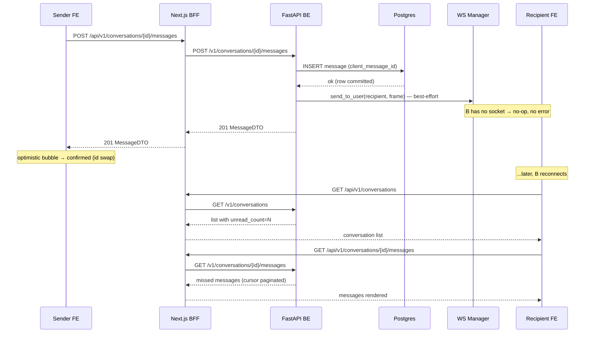

# NT208 HealthOS — System Architecture

> **Version**: 1.3.2  
> **Last Updated**: 2026-05-25  
> **Scope**: Web + Mobile + Microservices + Background Tasks

---

## Architecture Overview

HealthOS follows a **BFF (Backend-for-Frontend) pattern** for web and direct **REST + WebSocket** for mobile.

### Web Request Flow
```
Browser (HTTPS)
    ↓
Next.js BFF (port 3000)
    ├─ Authorization (httpOnly cookie)
    ├─ Rate limit pre-flight (Redis)
    └─ Proxy request
        ↓
Core API (port 8000, internal)
    ├─ FastAPI + SQLAlchemy async
    ├─ Validate input (Pydantic)
    ├─ Check JWT in blacklist (Redis)
    ├─ Apply rate limits (Redis)
    └─ Process request
        ↓
Data Layer (internal network)
    ├─ PostgreSQL 16 (persistent data)
    ├─ Redis 7 (cache, sessions, task queue)
    └─ MinIO (object storage)
        ↓
Response (JSON/binary)
    ↓
Browser (HTTPS)
```

### Mobile Request Flow
```
Mobile App (HTTPS via Expo)
    ↓
Core API (port 8000)
    ├─ Authorization (Bearer token from SecureStore)
    ├─ Rate limiting (Redis)
    ├─ JWT validation (check blacklist)
    └─ Process request
        ↓
Data Layer (PostgreSQL, Redis, MinIO)
        ↓
Response (JSON)
    ↓
Mobile App (AsyncStorage cache)
```

### Real-time Chat (WebSocket) + Offline Messaging + Group Chat
```
Browser/Mobile (WSS)
    ↓
Core API WebSocket (port 8000/ws)
    ├─ Upgrade HTTP → WebSocket
    ├─ Authenticate with JWT token
    ├─ Add to in-memory connection manager
    └─ Subscribe to room (conversation_id)
        ↓
Message received
    ├─ Validate input (Pydantic)
    ├─ Persist to PostgreSQL
    ├─ Check group membership + RBAC (owner/admin/member)
    ├─ Publish to Redis Pub/Sub (all connected clients receive)
    ├─ Notify offline members via _notify_conversation_members()
    │   └─ No-op for offline members (send_to_user skips empty socket set); catch up via REST on reconnect
    └─ Send to all subscribers (real-time delivery)
        ↓
Connected clients receive message (real-time)
Offline clients catch up through REST on reconnect or conversation open
```

**Group Chat Features**:
- Group creation + member management (REST API: POST, PATCH, DELETE `/conversations/{id}/members`)
- Role-based access control: owner → admin → member; owner leave auto-promotes; last-member leave soft-deletes
- Offline resilience: Messages persist in DB for offline members; ChatLayout refetches on reconnect
- Frontend: Group creation dialog, member picker, group info panel with role/leave/add actions

---

### Chat — Store-and-Forward Contract

**Invariant:** A message is durable before any WS delivery is attempted. All three send entrypoints persist through `chat_svc.send_message()`, which executes `db.add()` + `db.flush()` before the endpoint/router commits **before** any call to `ws_manager.send_to_user()` or `broadcast`. Per-user fanout exceptions never roll back the commit.

#### Send paths

| Entrypoint | Persist call site | WS broadcast |
|------------|------------------|--------------|
| REST `POST /conversations/{id}/messages` | `chat_svc.send_message` -> `db.flush()` x3 (`chat.py`), `db.commit()` at `conversations.py:380` | Room broadcast uses dead-socket cleanup; `_notify_conversation_members` is try/except wrapped |
| WS `msg:send` / `chat.message.send` | same `chat_svc.send_message`, `db.commit()` at `chat_router.py:199` | `broadcast_dual` + `fanout_to_members` (try/except wrapped) |
| AI stream `POST /messages/stream` | same `chat_svc.send_message`, `db.commit()` before the SSE generator starts | none for the user message at handler level; stream generator handles assistant events independently |

`ws_manager.send_to_user(user_id, frame)` is a no-op when `user_id` has no sockets (`handlers.py:162-165`).

#### Catch-up paths (offline recipient)

| Trigger | Path | Mechanism |
|---------|------|-----------|
| WS reconnect | `useChatWs.onopen` (when `wasReconnect=true`) → `onReconnect` callback → `refetchActiveConversation` + `refetchConversations` | Full REST refetch of active conv + list-level unread counts |
| Open conversation | `useMessages` mount/dep-change → `GET /v1/conversations/{id}/messages?limit=50` | Cursor pagination (`before=` timestamp); `has_more` flag drives scroll-up pagination |
| Unread count | `chat_svc.get_conversations` → `_get_bulk_conversation_data` | Counts messages where `created_at > member.last_read_at` (NULL = all messages unread) |

#### Idempotency (`client_message_id`)

Frontend generates `optimistic-<uuid>` before the POST and sends it as `client_message_id`. Backend deduplicates on `(conversation_id, client_message_id)` in `chat_svc.send_message`, backed by a partial unique index where `client_message_id IS NOT NULL`; duplicate POST returns the original DTO without inserting a new row. WS rebroadcast of the same `message.id` is merged in-place by `upsertMessage`.

#### Frontend outbox semantics

`useOutboundQueue` (IndexedDB) is the durable offline outbox:
- **Scope**: per-user database (`healthos-chat-{uid}`), per-conversation records.
- **Durability first**: UI only shows a composed-offline message as `queued` after IndexedDB write succeeds. If IDB is unavailable, the bubble remains failed/not queued.
- **Cap**: 200 items per conversation; oldest evicted with `onEvicted` callback.
- **Drain**: `flush(send)` is re-entrant-guarded (`flushingRef.current`) — concurrent `online` events never double-send.
- **Dedupe key**: `ChatWindow` uses `${convId}:${queuedItems.length}:${head.client_message_id}` to suppress duplicate drain effects during WS bouncing.
- **Error classification**: Only `error_code === "network"` auto-enqueues; `rate_limited` and `validation` errors stay `failed` and require manual retry.

#### Sequence diagram — offline recipient



---

## Component Diagram

```
┌─────────────────────────────────────────────────────────────────┐
│                      CLIENT LAYER                              │
├─────────────────────────────────────────────────────────────────┤
│                                                                 │
│  ┌──────────────────┐          ┌──────────────────┐            │
│  │   Web Browser    │          │  Mobile App      │            │
│  │  (React + TS)    │          │ (React Native)   │            │
│  │                  │          │                  │            │
│  │ • Dashboard      │          │ • Home tab       │            │
│  │ • Chat           │          │ • Care hub       │            │
│  │ • Settings       │          │ • Meds           │            │
│  └────────┬─────────┘          └────────┬─────────┘            │
│           │ HTTPS                       │ HTTPS                │
└───────────┼───────────────────────────────┼────────────────────┘
            │                               │
            ↓ (BFF only)                    ↓ (Direct)
┌───────────────────────────────────────────────────────────────┐
│                   GATEWAY / API LAYER                         │
├───────────────────────────────────────────────────────────────┤
│                                                               │
│  ┌─────────────────┐                ┌─────────────────────┐ │
│  │ Next.js BFF     │                │  FastAPI Core       │ │
│  │ (port 3000)     │────HTTPS──────▶│  (port 8000)        │ │
│  │                 │                │                     │ │
│  │ • Routes        │                │ • 30+ endpoints     │ │
│  │ • Auth proxy    │                │ • Validation        │ │
│  │ • Rate limit    │                │ • Rate limiting     │ │
│  │ • Error norm.   │                │ • WebSocket (WSS)   │ │
│  └─────────────────┘                │ • JWT validation    │ │
│           ▲                         └────────┬─────────────┘ │
│           │ (session cookie)                │               │
│           └─────────────────────────────────┘               │
│                                                             │
└──────────────────────────────┬──────────────────────────────┘
                               │ (async, auth-required)
┌──────────────────────────────┴──────────────────────────────┐
│                    SERVICE LAYER                           │
├───────────────────────────────────────────────────────────┤
│                                                            │
│  ┌──────────────┐ ┌──────────────┐ ┌──────────────────┐  │
│  │ Auth Service │ │ Chat Service │ │ Health Service   │  │
│  ├──────────────┤ ├──────────────┤ ├──────────────────┤  │
│  │ • Login      │ │ • Messages   │ │ • Vitals         │  │
│  │ • Register   │ │ • Reactions  │ │ • Goals          │  │
│  │ • MFA        │ │ • Presence   │ │ • Risk predict   │  │
│  │ • OAuth      │ │ • Pinned     │ │ • Trend analysis │  │
│  │              │ │ • Groups     │ │                  │  │
│  │              │ │ • RBAC       │ │                  │  │
│  │              │ │ • Offline    │ │                  │  │
│  │              │ │   fanout     │ │                  │  │
│  └──────────────┘ └──────────────┘ └──────────────────┘  │
│                                                            │
│  ┌──────────────┐ ┌──────────────┐ ┌──────────────────┐  │
│  │ Meal Service │ │ Reminder Svc │ │ Appointment Svc  │  │
│  ├──────────────┤ ├──────────────┤ ├──────────────────┤  │
│  │ • Nutrition  │ │ • Recurring  │ │ • Schedule       │  │
│  │ • Analysis   │ │ • Firing     │ │ • Notes          │  │
│  │ • History    │ │ • Quiet hrs  │ │ • Cancellation   │  │
│  └──────────────┘ └──────────────┘ └──────────────────┘  │
│                                                            │
└────────────────────────────┬─────────────────────────────┘
                             │
┌────────────────────────────┴─────────────────────────────┐
│                    DATA LAYER                           │
├───────────────────────────────────────────────────────┤
│                                                        │
│  ┌─────────────────────┐   ┌─────────────────────┐   │
│  │ PostgreSQL 16       │   │ Redis 7             │   │
│  │ (Primary storage)   │   │ (Cache + Queue)     │   │
│  ├─────────────────────┤   ├─────────────────────┤   │
│  │ • Users             │   │ • Session cache     │   │
│  │ • Health metrics    │   │ • OTP store         │   │
│  │ • Conversations     │   │ • Rate limiter      │   │
│  │ • Reminders         │   │ • Celery task queue │   │
│  │ • Audit logs        │   │ • Token blacklist   │   │
│  │ • Messages          │   │ • Pub/Sub (WS)      │   │
│  └─────────────────────┘   └─────────────────────┘   │
│                                                        │
│  ┌─────────────────────────────────────────────────┐  │
│  │ MinIO / S3-compatible (Object storage)          │  │
│  │ • User profile pictures                         │  │
│  │ • Meal photos                                   │  │
│  │ • PDF exports                                   │  │
│  │ • Audit log backups                             │  │
│  └─────────────────────────────────────────────────┘  │
│                                                        │
└────────────────────────────────────────────────────┘

┌────────────────────────────────────────────────────┐
│         BACKGROUND TASK LAYER (Celery)            │
├────────────────────────────────────────────────────┤
│                                                    │
│  Celery Beat (Scheduler)                          │
│    ├─ Every 5 min: Materialize daily reminders   │
│    ├─ Every 1 min: Fire due reminders            │
│    ├─ Daily 06:00: Email med refill alerts       │
│    └─ Daily 03:00: Purge soft-deleted accounts   │
│         ↓                                         │
│  Redis (Task queue)                              │
│         ↓                                         │
│  Celery Worker(s)                                │
│    ├─ process_meal_image (→ AI Worker)           │
│    ├─ notification_dispatch (Core in-app/SMTP)   │
│    └─ wearable sync tasks (owned separately)     │
│                                                   │
└────────────────────────────────────────────────────┘

┌────────────────────────────────────────────────────┐
│         EXTERNAL SERVICES & WORKERS               │
├────────────────────────────────────────────────────┤
│                                                    │
│  AI Worker (port 8001)                           │
│    • YOLOv10 food detection (local inference)    │
│    • Text generation via local OpenAI proxy      │
│                                                    │
│  Notification Service (port 8002)                │
│    • /dispatch validation + optional SMTP demo   │
│    • Push/SMS providers return skipped reasons   │
│                                                    │
│  External APIs                                    │
│    • Google OAuth                                 │
│    • GitHub OAuth                                │
│    • HIBP (Have I Been Pwned)                     │
│                                                    │
└────────────────────────────────────────────────────┘
```

---

## Admin Console Architecture

### Shell Design

Admin console UI built on token-driven design system with sidebar collapse state persisted to localStorage.

**Layout Structure**
```
AdminShell (wrapper)
  ├─ AdminSidebar (collapsible nav)
  │   ├─ CSS custom properties (--admin-sidebar-bg, --admin-fg, --admin-accent, etc.)
  │   ├─ aria-current="page" on active links
  │   └─ Collapse state: localStorage key "healthos.admin.sidebar-collapsed"
  └─ AdminTopBar (header + identity menu)
      ├─ AdminEnvBadge (dev/staging indicator)
      └─ User identity menu (RBAC indicator ready)
```

**Layout Primitives** (`admin-layout-primitives.tsx`)
- `AdminPageContent` — main content wrapper with safe padding
- `AdminPageHeader` — page title + actions bar
- `AdminCard` — card container with token-driven styling
- `AdminToolbar` — action toolbar (filters, toggles, exports)

### Component Library

**Shared Admin Components**
| Component | Purpose | Ref |
|-----------|---------|-----|
| KpiCard + Sparkline | 7-point trend visualization | Phase 3 |
| UsersTable | density/column-visibility toggles, search | Phase 4 |
| UserDetailSections | profile, subscription audit tabs | Phase 5 |
| PlansTable | subscription metrics, edit modal | Phase 6 |
| AuditTable | event log with filter bar | Phase 7 |
| SecurityFeed | severity badges, timeline | Phase 7 |

### Pages

| Route | Components | Status |
|-------|-----------|--------|
| `/admin` | OverviewCards, ActivityFeed | Complete (Phase 3) |
| `/admin/users` | UsersTable, ColumnVisibilityMenu | Complete (Phase 4) |
| `/admin/users/[id]` | UserDetailActionBar, sections, audit tab | Complete (Phase 5) |
| `/admin/subscriptions` | PlansTable, PlanMetricsStrip, EditPlanModal | Complete (Phase 6) |
| `/admin/audit` | AuditTable, AuditFilterBar | Complete (Phase 7) |
| `/admin/security` | SecurityFeed, SeverityBadge | Complete (Phase 7) |

### Design Tokens

```css
/* Sidebar */
--admin-sidebar-bg: [light: #f8f9fa, dark: #1f2937]
--admin-sidebar-fg: [light: #111827, dark: #f3f4f6]
--admin-sidebar-accent: [light: #3b82f6, dark: #60a5fa]
--admin-sidebar-active-bg: [light: #e5e7eb, dark: #374151]

/* Header */
--admin-header-height: 64px
--admin-header-bg: [light: #ffffff, dark: #111827]

/* Density */
--admin-row-height-compact: 36px
--admin-row-height-default: 44px
--admin-row-height-relaxed: 56px
```

### A11y & Motion

- `aria-current="page"` marks active sidebar link
- `scope="col"` on all table header cells
- `motion-safe:` prefix gates `animate-*` and `transition-*` classes (respects user's prefers-reduced-motion)

### Internationalization (i18n)

Admin console UI fully supports next-intl with `admin.*` namespace:

**Message keys structure:**
```
admin.userDetail          → User detail page (profile, subscription, activity sections)
admin.users              → Users list page
admin.subscriptions      → Subscription plans management page
admin.common             → Shared labels (save, cancel, delete, etc.)
admin.errors             → Admin-specific error messages (Max retries reached, etc.)
```

**Locales supported:** English (`en.json`) + Vietnamese (`vi.json`)

**BFF subscription quick-action payloads** (`src/lib/admin/subscription-quick-action-payloads.ts`):
- `buildCancelPayload()` — Cancels subscription, preserves `expires_at`
- `buildExtendPayload(days)` — Extends N days from expiry (or `now` if expired/canceled)
- `buildResetFreePayload()` — Resets user to Free plan, clears expiry

**Subscription assignment form** (`UserDetailSubscriptionForm.tsx`):
- Zod validation for plan selection and duration
- Error boundary + field-level error display
- Calls PATCH `/api/v1/admin/users/[id]/subscription` via BFF

### Testing

- **9 test files** covering shell, components, pages, integration
- **150 tests** (all passing):
  - Shell: AdminSidebar collapse, AdminTopBar rendering
  - Components: KpiCard, UsersTable density/visibility, UserDetailSections
  - Pages: Overview, users list, user detail, subscriptions, audit
  - Integration: navigation, RBAC decorator readiness
- **Playwright smoke spec** (`e2e/admin-redesign.spec.ts`) — gated by `ADMIN_E2E=1`; validates sidebar collapse, table interactions, page navigation

### Known Gaps

- **Subscription history**: BFF stub returns `[]`; new BE table `subscription_assignments` deferred to follow-up plan
- **Audit tab**: BFF stub returns `[]`; Core `/v1/admin/users/{id}/audit` deferred to follow-up plan
- **Endpoint wiring**: RBAC permission checks not yet wired to backend endpoints (deferred to v1.3)
- **Backend integration**: 6 admin pages render mock data where real BFF routes exist; subscription quick-actions + history wired to BFF stubs

---

## Observability & Logging

### Structured Logging Layer
Core API emits structured JSON logs with request context:
```
{
  "timestamp": "2026-05-22T10:15:30.123Z",
  "level": "INFO",
  "request_id": "uuid-1234",
  "event": "auth.login_success",
  "user_id": "abc123",
  "duration_ms": 145,
  "ip": "192.168.1.1"
}
```

**Key settings** (`backend/app/core/config.py`):
- `log_format` — "json" (production) or "text" (dev)
- `metrics_token` — `X-Metrics-Token` secret for /metrics access
- `metrics_allow_local` — Allow /metrics from localhost in development only

### Request Context & Tracing
- **Request ID**: UUID v4 generated on browser (frontend) or request entry (BFF/Core)
- **X-Request-ID header**: Propagated BFF → Core via `coreProxy()`
- **Context var**: `ContextVar request_id_var` available in all handlers + services
- **RequestIdFilter**: Auto-injects into every log record

### Health Checks (Liveness vs Readiness)
```
GET /health               → 200 OK (always — liveness probe)
GET /health/ready         → 200 OK / 500 (depends on DB + Redis — readiness probe)
```

**Docker Compose integration**:
- Container healthcheck: calls `/health/ready`
- Depends-on: waits for readiness before starting dependent services
- Smoke tests: validate both endpoints before app-ready

### Metrics Endpoint
```
GET /metrics              → Prometheus format (guarded by metrics_token)
```

**Access control**:
- Requires `X-Metrics-Token: {metrics_token}` in staging/production
- If `metrics_allow_local=true`: localhost/127.0.0.1 bypass token check in development only
- Metric types: request latency, error rates, DB pool stats, cache hit rates

### PHI Logging Safety
- **Email masking**: `hash_email()` in `event_logging.py` — SHA-256 hashed, salted
- **Sensitive fields**: Not logged (passwords, tokens, credit cards)
- **Audit log**: Separate table (AuditLog model) for compliance tracking
- **Log rotation**: Daily + size-based via `logging.handlers.RotatingFileHandler`

---

## Service Ports Reference

| Service | Port | Protocol | Purpose |
|---------|------|----------|---------|
| Frontend (Next.js BFF) | 3000 | HTTP/HTTPS | Web UI + BFF route handlers |
| Core API (FastAPI) | 8000 | HTTP/HTTPS + WSS | REST endpoints + WebSocket |
| AI Worker | 8001 | HTTP | YOLO meal detection + proxy-backed text generation |
| Notification Service | 8002 | HTTP | Push/email dispatch (stub) |
| PostgreSQL | 5432 | TCP | Database (internal) |
| Redis | 6379 | TCP | Cache + queue (internal) |
| MinIO | 9000/9001 | HTTP | S3-compatible storage + console |

---

## Data Flow Examples

### 1. User Login Flow

```
Browser (POST /api/v1/auth/login)
    ↓ [email, password]
BFF Route Handler
    ├─ Check rate limit (Redis)
    ├─ Call coreProxy('/v1/auth/login')
    └─ Set httpOnly session cookie (contains JWT)
        ↓
Core API (POST /v1/auth/login)
    ├─ Fetch user by email
    ├─ Verify password (bcrypt)
    ├─ Check HIBP for breach (async)
    ├─ Generate JWT with jti claim
    ├─ Return access_token + refresh_token
        ↓
BFF Route Handler
    ├─ Parse response
    ├─ Set httpOnly cookie (refresh_token)
    └─ Return JSON to browser
        ↓
Browser
    ├─ Store JWT in cookie (httpOnly)
    ├─ Redirect to /dashboard
    └─ On next request, cookie auto-sent in Authorization header
```

### 2. Chat Message Flow (WebSocket) + Group Messaging + Offline Delivery

```
Browser/Mobile (WSS /ws/chat/conversation_id)
    ↓ [message: "How are you?"]
Core API WebSocket Handler
    ├─ Authenticate JWT token
    ├─ Add to connection manager (in-memory list)
    ├─ Verify group membership + check role (owner/admin/member)
    ├─ Parse message (Pydantic validation)
    ├─ Persist to PostgreSQL (Message table)
    ├─ Publish to Redis Pub/Sub (channel: conversation_id)
    ├─ Notify offline members via _notify_conversation_members()
    │   └─ For each member not currently connected:
    │       ├─ send_to_user is a no-op when no socket exists
    │       └─ Message stays durable in Postgres for REST catch-up
    └─ Return OK
        ↓
Redis Pub/Sub
    ├─ Broadcast to all subscribers of conversation_id
    └─ Each connected client receives (in-memory listener)
        ↓
Browser + Other participants
    ├─ Receive message object
    ├─ Append to messages state
    └─ Render in UI (real-time)
        ↓
Offline clients (on reconnect)
    ├─ BFF calls /conversations/{id} to refresh members
    ├─ BFF calls /conversations/{id}/messages to fetch latest
    └─ UI updates with missed messages + new members/roles
```

**Group Chat Constraints**:
- Only group members (owner/admin/member) can send messages
- Message edits + deletes scoped to sender or owner
- Member role changes propagated in real-time (role channel)
- Last-member departure soft-deletes conversation (deleted_at set)
- Owner departure auto-promotes oldest admin; if no admin, auto-deletes


### 3. Reminder Firing Flow (Background Task)

```
Celery Beat (every 1 minute)
    ├─ Query: SELECT * FROM reminder_occurrences WHERE due_time <= NOW()
    └─ Enqueue task: fire_reminders(reminder_ids)
        ↓
Redis Task Queue
        ↓
Celery Worker
    ├─ Dequeue task
    ├─ For each reminder:
    │   ├─ Fetch user preference (notification channel)
    │   ├─ Enqueue task: notification_dispatch(event)
    │   └─ Mark occurrence as fired (PostgreSQL)
    └─ Return
        ↓
Redis Task Queue (notification_dispatch job)
        ↓
Celery Worker
    ├─ Persist Core in-app notification or call optional provider path
    ├─ Request: { event_id, recipient_id, title, body, channel }
    └─ Return
        ↓
Notification Service
    ├─ Validate /dispatch payload and optional SMTP email
    ├─ Call external service (FCM, SendGrid) [stub for now]
    └─ Return
        ↓
User receives notification (push/email/in-app)
```

### 4. Meal Photo Analysis Flow

```
Mobile App (POST /api/v1/meals/analyze-photo)
    ├─ Select photo from camera roll
    ├─ Encode as multipart/form-data
    └─ Send with Authorization header (Bearer token)
        ↓
Core API (POST /v1/meals/analyze)
    ├─ Validate JWT token
    ├─ Fetch image from request
    ├─ Enqueue async task: meal_analysis(user_id, image_data) [Celery task in backend/app/tasks/meal_analysis.py]
    └─ Return { job_id: "uuid", status: "processing" }
        ↓
Mobile App
    ├─ Store job_id
    ├─ Poll (GET /api/v1/meals/analyze-photo/[job_id]) every 1-2 sec
    └─ Show loading spinner
        ↓
Celery Worker (async, backend/app/tasks/meal_analysis.py)
    ├─ Receive task: meal_analysis
    ├─ Call AI Worker (port 8001, POST /analyze)
    │   ├─ Send: image bytes
    │   └─ Receive: { detected_items: [...], nutrition: {...} }
    ├─ Store result in PostgreSQL (MealResult)
    ├─ Update Redis job status (job_id → result)
    └─ Return
        ↓
Mobile App (polling)
    ├─ GET /api/v1/meals/analyze-photo/[job_id]
    ├─ Receive: { status: "complete", result: {...} }
    └─ Display nutrition breakdown, macros, suggestions
```

---

## Authentication & Authorization

### JWT Token Lifecycle

```
Login Request
    ↓
Core API validates email + password
    ↓
Generate JWT:
  {
    "sub": user_id,
    "jti": "unique_token_id",
    "iat": 1234567890,
    "exp": 1234571490,
    "iss": "healthos",
    "aud": "healthos-users"
  }
    ↓
Set httpOnly cookie (session)
Set refresh_token cookie (for token refresh)
    ↓
Browser (next request)
    ├─ Auto-send httpOnly cookies
    └─ BFF checks Authorization header or cookie
        ↓
Core API
    ├─ Decode JWT
    ├─ Check jti NOT in Redis blacklist
    ├─ Check exp > now
    ├─ Check iss + aud (TODO: enforce in v1.3)
    └─ Allow request ✅
        ↓
Logout Request
    ↓
BFF adds JWT jti to Redis blacklist (ttl = token_lifetime)
    ↓
Future requests
    ├─ JWT decoded
    ├─ jti found in blacklist
    └─ Request rejected (401) ❌
```

### MFA Flow (TOTP)

```
User enables MFA
    ↓
Backend generates TOTP secret (pyotp)
    ├─ Encrypt with Fernet (AES-128)
    └─ Store in database (UserMfaSecret.encrypted_secret)
        ↓
User scans QR code (Google Authenticator, Authy, etc.)
    └─ TOTP app generates 6-digit codes (30-sec roll)
        ↓
Login with email + password
    ↓
Backend validates password ✅
    ↓
Check: is_mfa_enabled?
    ├─ NO → Set session cookie, return JWT ✅
    └─ YES → Return challenge (status: "mfa_required")
        ↓
Frontend prompts user for TOTP code
    ↓
POST /v1/auth/verify-mfa { code: "123456" }
    ↓
Backend
    ├─ Decrypt TOTP secret (Fernet)
    ├─ Verify code (pyotp.totp.verify with ±30sec tolerance)
    ├─ Success → Set session cookie, return JWT ✅
    └─ Failure → Reject (401) ❌
        ↓
**Known Gap**: Password login does not enforce MFA challenge
  even when mfa_enabled=true (TODO v1.3)
```

### CSRF Origin Guard

All BFF mutating routes (POST/PUT/PATCH/DELETE) enforce an Origin/Referer guard via `assertSameOrigin()` in `src/lib/bff-origin-guard.ts`. Guard is wired into:

- Core proxy layer: `coreProxy()` and `coreFetchStream()` for all proxy routes
- Direct-fetch handlers: auth/route.ts, auth/refresh/route.ts, auth/reset-password/route.ts, auth/request-otp/route.ts, auth/verify-otp/route.ts, auth/check-username/route.ts, auth/check-email/route.ts, auth/ws-token/route.ts, users/me/avatar/route.ts, meals/route.ts, health/route.ts, health-data/route.ts, health-data/meal/route.ts, health-goals/route.ts, analytics/gamification-summary/route.ts

**Validation logic:**
- Extract Origin/Referer header
- Compare host:port against `BFF_TRUSTED_ORIGINS` (env-configured, comma-separated)
- Non-production: implicit localhost:*, 127.0.0.1:* allowed
- Production: empty origins = fail-closed (reject all mutating requests lacking matching Origin)

**Guard mode** (`BFF_CSRF_GUARD_MODE` env):
- `dry-run`: Log rejection, forward anyway (migration window)
- `enforce` (default production): Return 403 with `{error: {code: "CSRF_ORIGIN_REJECTED"}}`

**Public exceptions:** `/api/v1/public/**` paths exempt via `EXEMPT_PATH_PREFIXES` allow-list. OAuth init routes (GET-only) return null (no-op). Callbacks exempt by being GET.

### Route Protection

The Next.js middleware (`src/proxy.ts`) gates every private page before the request reaches the app.

**Protected prefixes** (defined in `PROTECTED_PREFIXES`):
- `/dashboard` — all authenticated app pages
- `/onboarding` — handled separately (session required; completed users are bounced to dashboard)

**Public pages** (no session required): `/`, `/login`, `/register`, `/verify`, `/forgot-password`, `/about`, `/articles`, `/plans`, `/services`, `/legal/*`, `/e/[token]`, `/dev/kitchensink`.

**Source of truth:** `src/__tests__/proxy-protected-routes.fixture.ts` enumerates every page classified as private or public. The companion test globs `app/[locale]/**/page.tsx` at test time and fails CI if any new page is added without a classification entry. Adding a private page outside `/dashboard` requires both a fixture update and a new entry in `PROTECTED_PREFIXES`.

**Security note:** The middleware redirect is a UX gate, not an authorization boundary. The Core BE validates the JWT on every request; the `(app)` layout also revalidates the session for defence-in-depth.

### Rate Limiting Strategy

```
Request arrives at Core API
    ↓
Determine limiter bucket:
  • Login attempts: key = "login:{ip}:{email}", limit = 10/min
  • OTP requests: key = "otp:{ip}:{email}", limit = 5/min
  • API requests: key = "api:{ip}:{user_id}", limit = 30/min
  • WebSocket msgs: per-connection burst = 10/sec
    ↓
Redis INCR key (increment counter)
    ├─ First increment → SET TTL (60 sec for rate limits)
    └─ Return count
        ↓
Check: count > limit?
    ├─ NO → Allow request ✅
    └─ YES → Return 429 Too Many Requests ❌
        ↓
Fail Closed: If Redis unavailable → 503 (don't allow through)
```

---

## Asynchronous Job Architecture (Celery)

### Beat Schedule

```
Celery Beat (TICK every minute)
    ├─ Check trigger: is_minute_5? (every 5 min)
    │   └─ Task: materialize_daily_reminders
    │       • Query user daily reminders (recurring)
    │       • For today: INSERT ReminderOccurrence
    │
    ├─ Check trigger: every minute
    │   └─ Task: fire_reminders
    │       • Query due ReminderOccurrence (past due_time)
    │       • For each: enqueue notification_dispatch
    │       • Mark as fired
    │
    ├─ Check trigger: is_06_00? (daily at 6 AM)
    │   └─ Task: send_med_refill_alerts
    │       • Query medications expiring soon
    │       • Send email alerts to users
    │
    └─ Check trigger: is_03_00? (daily at 3 AM)
        └─ Task: purge_soft_deleted_accounts
            • Query soft-deleted users (> 30 days)
            • DELETE user row (cascade deletes all data)
```

### Task Workflow Example (Meal Photo Analysis)

```
Mobile app calls: POST /api/v1/meals/analyze-photo
    ↓ [multipart image]
Core API endpoint
    ├─ Parse image + validate JWT
    ├─ Generate job_id (UUID)
    ├─ Enqueue Celery task:
    │   celery.send_task('process_meal_image', args=[user_id, image_data])
    └─ Return { job_id, status: "processing" }
        ↓
Mobile app polls: GET /api/v1/meals/analyze-photo/{job_id}
    ├─ Redis GET {job_id}
    └─ Return { status: "processing" } (not ready yet)
        ↓ (1-2 sec later)
Celery Worker (background)
    ├─ Dequeue task
    ├─ Prepare image
    ├─ POST http://localhost:8001/analyze [image]
    ├─ AI Worker returns: { items: [...], nutrition: {...} }
    ├─ Store in PostgreSQL (Meal, MealResult, Nutrition)
    ├─ SET Redis {job_id} → { status: "complete", result: {...} }
    └─ Return
        ↓
Mobile app polls again
    ├─ Redis GET {job_id}
    └─ Return { status: "complete", result: {...} } ✅
        ↓
Mobile app displays nutrition breakdown
```

---

## Key Design Decisions

### 1. BFF Pattern for Web
**Rationale**: 
- Security: Core API never exposed to browser (eliminates CORS, credential leaks)
- Flexibility: BFF can add auth middleware, rate limiting, error normalization
- Privacy: Sensitive data (tokens, secrets) never leave backend

### 2. Direct API for Mobile
**Rationale**:
- Performance: Eliminates extra hop (mobile → BFF → Core)
- Simplicity: No cookie/session overhead
- Security: Bearer tokens in SecureStore (more secure than browser storage)

### 3. WebSocket for Real-time Chat
**Rationale**:
- Low latency: Bidirectional connection, no polling overhead
- Scalability: Redis Pub/Sub allows multi-replica broadcast
- User experience: Immediate message delivery (no 1-5 sec delay)

### 4. Celery for Background Tasks
**Rationale**:
- Async processing: Long-running tasks don't block API requests
- Reliability: Celery retries failed tasks
- Scheduling: Beat allows periodic jobs (reminder materialization, account purge)

### 5. Async-first Transaction Safety (Backend)
**Rationale**:
- Explicit commits: Write endpoints explicitly call `await db.commit()`; read endpoints do not. Prevents accidental mutations persisting on GET paths.
- Separation of concerns: FastAPI dependency injector (`get_db`) manages rollback-on-exception only; endpoints own transaction boundaries.
- Alembic compatibility: Centralized ORM model registry in `app/models/__init__.py` ensures Alembic autogenerate sees all tables without app import side-effects.

### 6. Redis for Rate Limiting (Fail Closed)
**Rationale**:
- Performance: O(1) counter increment
- TTL support: Counters auto-expire after time window
- Fail closed: If Redis down, reject requests (safer than allowing)

### 7. Resource Ownership (IDOR Protection)
**Rationale**:
- Every service function that fetches a user-owned resource (appointments, reminders, meals, health metrics, etc.) filters by `user_id` in the WHERE clause — returning `None` / `404 NOT_FOUND` on ownership mismatch rather than `403`, to avoid leaking resource existence.
- The `get_owned(db, Model, id_=..., user_id=...)` helper in `app/services/_ownership.py` centralises this pattern; services call it instead of writing raw `select().where(id == ...).where(user_id == ...)`.
- Chat endpoints enforce membership via `assert_member(db, conversation_id, user_id)` before any read or write; the WS dispatcher wraps every message handler with the same gate.
- Celery tasks verify `req.user_id == user_uuid` immediately after loading the job row to prevent broker-level argument tampering.
- Ownership denials are logged as `SECURITY_ACCESS_DENIED` audit events in a separate session (so the log row persists even if the caller transaction rolls back). These rows are filtered from the user-facing `/security-logs` endpoint.
- A static guardrail script (`backend/scripts/check_idor.py`) scans endpoint handlers, service functions, and the WS dispatcher for missing ownership checks; it runs in CI and locally before push.

---

## Known Limitations & Future Improvements

| Issue | Current State | Target Fix |
|-------|---------------|-----------|
| **WebSocket presence** | In-memory only (not shared across replicas) | v2.0: Redis-backed presence |
| **Notification dispatch** | Stub (queues only, doesn't send) | v1.3: Call FCM/SendGrid |
| **JWT iss/aud validation** | Not enforced (single issuer in dev) | v1.3: Add validation |
| **MFA enforcement** | Password login bypasses MFA challenge | v1.3: Enforce challenge |
| **OAuth token refresh** | Not implemented | v2.0: Add OAuth refresh |
| **Multi-tenant support** | Single tenant (future) | v3.0: Organization support |
| **Group invitation system** | Groups auto-joined; no invitations yet | v1.4: Add invite flow |

---

## Deployment Topology

### Development (Docker Compose)
```
Host Machine
  ├─ Docker Desktop (engine)
  │   ├─ postgres:latest (container 5432)
  │   ├─ redis:latest (container 6379)
  │   ├─ minio/minio (container 9000/9001)
  │   ├─ healthos-backend (container 8000)
  │   ├─ healthos-frontend (container 3000)
  │   ├─ healthos-ai-worker (container 8001)
  │   ├─ celery-worker (background)
  │   └─ celery-beat (scheduler)
  │
  └─ Access: http://localhost:3000 (frontend)
```

### Production (Kubernetes / Cloud)
```
Load Balancer (Cloudflare, HAProxy)
    ↓ (HTTPS)
Next.js BFF Replicas (3+ instances, port 3000)
Core API Replicas (3+ instances, port 8000)
    ├─ PostgreSQL Cluster (HA, read replicas)
    ├─ Redis Cluster (Sentinel, auto-failover)
    ├─ MinIO Cluster (erasure coding)
    ├─ Celery Worker Pool (scaling)
    └─ Celery Beat (single instance, backup standby)
```

---

## Authorization (RBAC)

### Tables

| Table | Purpose |
|-------|---------|
| `roles` | Named roles (`user`, `admin`). `code` is unique slug. |
| `permissions` | Flat permission codes (e.g. `admin.users.read`). |
| `user_roles` | (user_id, role_id) assignment. `user_id` FK is `RESTRICT` — role must be explicitly revoked before a user row can be hard-deleted. |
| `role_permissions` | (role_id, permission_id) linking. |

### Default Data (seeded by `seed_admin.py`)

**Roles:** `user`, `admin`

**Permissions (admin role):** `admin.access`, `admin.users.read`, `admin.users.update`, `admin.users.ban`, `admin.subscriptions.read`, `admin.subscriptions.update`, `admin.metrics.read`

### Gating a Route

```python
from app.core.rbac_deps import require_permission

@router.get("/admin/users", dependencies=[Depends(require_permission("admin.users.read"))])
async def list_users(...):
    ...
```

`require_role("admin")` and `require_permission("admin.access")` both raise `ForbiddenException` (code `FORBIDDEN`, HTTP 403) — single generic message, no role/permission enumeration.

### Admin Status

Admin status is derived entirely from the `user_roles` table — there is no `is_admin` column on `users`. Use `is_admin_user(user, db)` from `app.core.rbac_deps` for non-HTTP contexts (Celery beats, scripts).

### Soft-Delete Safety

`has_role()` and `has_permission()` filter `User.deleted_at IS NULL`. A soft-deleted user with a retained `user_roles` row does **not** pass authorization. `account_deletion.request_deletion()` must revoke all role grants before soft-deleting a user.

### Seed & Revoke

```bash
# Create/update admin — idempotent
SEED_ADMIN_EMAIL=admin@healthos.local SEED_ADMIN_PASSWORD='changeme' python seed_admin.py

# Multi-email
SEED_ADMIN_EMAILS=a@x.com,b@x.com SEED_ADMIN_PASSWORD='changeme' python seed_admin.py

# Revoke admin role only (keep user row)
SEED_ADMIN_EMAIL=admin@healthos.local python delete_seed_admin.py --revoke-role

# Legacy: delete user row entirely
SEED_ADMIN_EMAIL=admin@healthos.local python delete_seed_admin.py --confirm
```

Emails are normalized to lowercase. Local-part `admin` is rewritten to `admin_seed` to avoid the reserved username.

### Rollback Runbook

**If migration applied but seed failed mid-loop:**
1. Inspect stderr to identify failed email.
2. Re-run `seed_admin.py` — single-commit transaction; partial role/permission rows are idempotent.

**Full rollback (Red Team #12 — coupled pair):**
1. **Code revert first**: revert `User.roles` relationship in `app/models/core.py` and the re-export in `app/models/__init__.py`.
2. Deploy the reverted code.
3. Then: `cd backend && alembic downgrade 035_merge_security_and_app_heads`
4. Verify: `python -c "from app.main import app; print('ok')"`

> **Order matters.** Running `alembic downgrade` before reverting code causes app boot crash — SQLAlchemy tries to reflect the now-dropped `user_roles` table via `User.roles`.

---

## References

- [Project Overview](./project-overview-pdr.md)
- [Codebase Summary](./codebase-summary.md)
- [Security Guide](./security.md)
- [Deployment Guide](./deployment-guide.md)
- [API Compatibility Guide](./api-compatibility.md)
- [API Codegen](./api-codegen.md)
